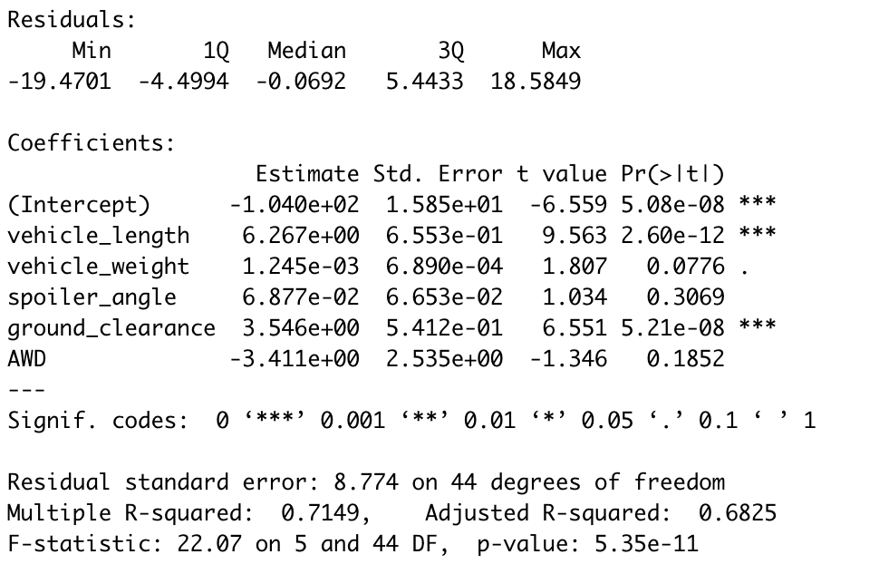
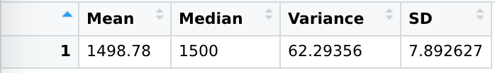
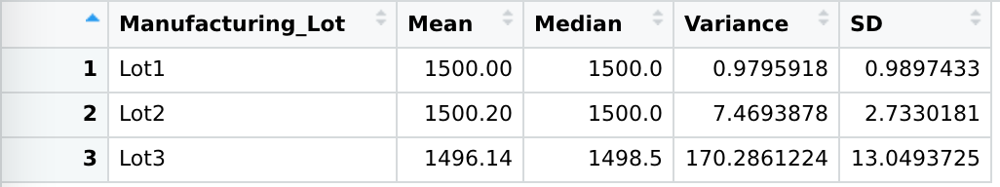
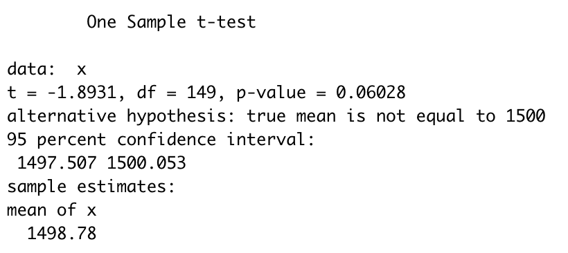
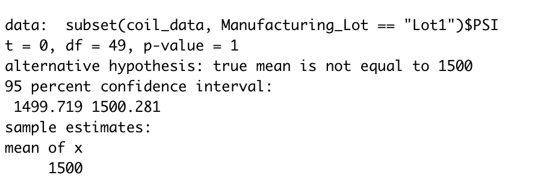
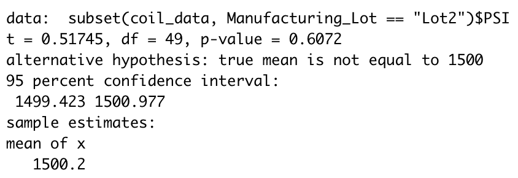
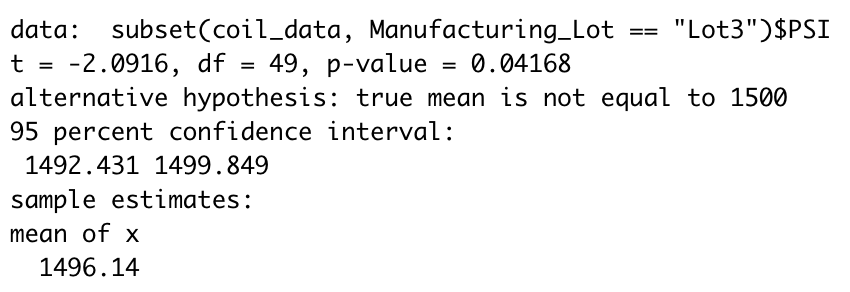

# MechaCar_Statistical_Analysis

## Overview

The following analysis uses statistical methods to determine the quality of MechaCar vehicles. The goals are 1) to verify that production standards are being met 2) to determine what factors of these vehicles are correlated with each other. 

## Linear Regression to Predict MPG

The image below shows the summary of the multiple regression analysis. The overall p-value for this analysis is 5.35e-11. Since this value is less than the cut-off value of 0.05, we reject the null and conclude that the slope of the regression model is non-zero.

The column labeled "Pr(>|t|)" displays the p-values for each variable. The cut-off value is 0.05, meaning 3 variables of the 6 rejected the null. These variables are the intercept, the vehicle length, and the ground clearance. This result means that the variance of these variables were too large to have happended just by chance. The variance in the intercept tells us that there is variation in the model that is not explained by the 5 independent variables; there may be other variables that could be correlated with mpg.

The inclusion of variables that are not statistically significant (vehicle weight, spoiler angle, an AWD) in the regression model could be causing our model to overfitt the sample data. In other words, our data will predict the mpg of novel data less accurately. It may be a good idea to remove these variables if this regression is to be used to predict mpg on new data.

The multiple R-squared tells us the overall fit the model has on the dataset. The value is 0.7149, which is considered a high correlation in most industries. In other words, the model performs well in predicting the mpg of MechaCar prototypes. However, this model would likely improve if the non-correlated variables were removed, even if it meant the r-squared value would decrease, because this way our model would perform better on novel data, not just the sample data used in this analysis. 

## Summary Statistics on Suspension Coils

Design specifications dictate that the variance of the supsension coil must not exceed 100 pounds per square inch (PSI). Looking at the data below, the variance is 67 PSI. Therefore, the specifications appear to be met. However, when breaking down the variance by each lot, we see that lot 3 has a variance of 107 PSI. As a result, we must conclude that Lot 1 and 2 meet design specifications but Lot 3 does not. This abberation must be reported to the designated personnell as soon as possible. 

## T-Tests on Suspension Coils

The mean pressure for all MechaCars is 1500 PSI. Performing a t-test on the whole sample yields a p-value of 0.06, so the variation in pressure for the sample is likely due just to chance. When performing the t test on each lot, the p-values are different. The p-value for Lot 1 and Lot 2 are 1 and 0.61, respectively. Therefore the variation in pressure for Lot 1 and Lot 2 is due to only chance. However, the p-value for Lot 3 is 0.042, so the variation in pressure is too large to be due just to chance. This result corroborates the results of the last section, where it was concluded that Lot 3 failed to meet specifications.

## Study Design: MechaCar vs Competition

There are additional statisticall studies that could determine how MechaCar performs against the competition. One metric is horsepower, which is a measure of how quickly a car can accelerate. Having high horsepower is important for driving on high-ways and carrying large amounts of weight.

For such a test, the null hypothesis would be that MechaCars do not have higher horespower than cars from competitors. The alternative hypothesis would be that Mechacars do have higher horsepower. 

For this analysis, a one-directional, two-sample t-test could be performed, with a cut-off value of 0.05 for the p-value. This would tell us if the difference between horespowers is simply due to chance or because of the car brand itself. The test would be one-directional because we are stating that the horsepower of MechaCars would be higher. 

Gathering this data would likely be feasible because horsepower is a common metric recorded for vehicles. To obtain the data, car websites could be scraped using Python and Beautiful Soup. This is an excellent idea for a future project. 
